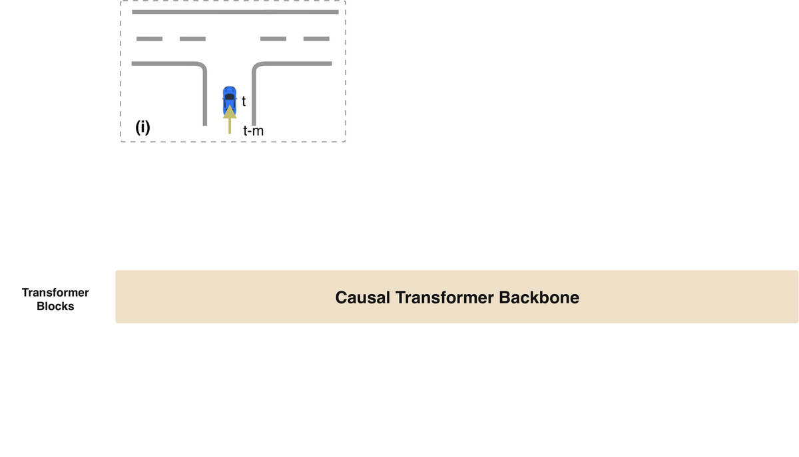

# State Transformer

State Transformer (STR) is a general model for both motion prediction and motion planning  across multiple large-scale real-world datasets. We reformulate the motion prediction and motion planning problem by arranging all elements into a sequence modeling task. Our experiment results reveal that large trajectory models (LTMs), such as STR, adhere to the scaling laws by presenting outstanding adaptability and learning efficiency when trained using larger Transformer backbones. Qualitative analysis illustrates that LTMs are capable of generating plausible predictions in scenarios that diverge significantly from the training dataset’s distribution. LTMs can also learn to make complex reasonings for long-term planning, extending beyond the horizon of 8 seconds, without explicit loss designs or costly high-level annotations. Checkout our paper for more details.

**Large Trajectory Models are Scalable Motion Predictors and Planners**

Authors: [Qiao Sun](https://qiaosun.me/), [Shiduo Zhang](https://github.com/Shiduo-zh), [Danjiao Ma](https://github.com/dmame), [Jingzhe Shi](https://github.com/JingzheShi), [Derun Li](https://github.com/Dylan-LDR/), [Simian Luo](https://github.com/luosiallen), [Yu Wang](https://scholar.google.com/citations?user=uNj2w9gAAAAJ&hl=en), [Ningyi Xu](http://www.qingyuan.sjtu.edu.cn/a/xu-ning-yi-1.html), [Guangzhi Cao](https://scholar.google.com/citations?user=XY7knjAAAAAJ&hl=en&oi=ao), [Hang Zhao](https://hangzhaomit.github.io/)

[[Arxiv](http://arxiv.org/abs/2310.19620)]

# Abstract

Motion prediction and planning are vital tasks in autonomous driving, and recent efforts have shifted to machine learning-based approaches. 
The challenges include understanding diverse road topologies, reasoning traffic dynamics over a long time horizon, interpreting heterogeneous behaviors, and generating policies in a large continuous state space. 
Inspired by the success of large language models in addressing similar complexities through model scaling, we introduce a scalable trajectory model called State Transformer (STR). STR reformulates the motion prediction and motion planning problems by arranging observations, states, and actions into one unified sequence modeling task.
Our approach unites trajectory generation problems with other sequence modeling problems, powering rapid iterations with breakthroughs in neighbor domains such as language modeling.
Remarkably, experimental results reveal that large trajectory models (LTMs), such as STR, adhere to the scaling laws by presenting outstanding adaptability and learning efficiency.
Qualitative results further demonstrate that LTMs are capable of making plausible predictions in scenarios that diverge significantly from the training data distribution. LTMs also learn to make complex reasonings for long-term planning, without explicit loss designs or costly high-level annotations.

# Method

* Causal Transformer for sequence modeling instead of Encoder-Decoder models
* Easy modify the backbone to scale or replace with other LLMs
* Versatile for adding classification loss or rule-based post-processions



# Usage

## Prepare Environment

Install Pytorch with CUDA first (our recommendation is `pip install torch==1.9.0+cu111 torchvision==0.10.0+cu111 torchaudio==0.9.0 -f https://download.pytorch.org/whl/torch_stable.html`). Then run `pip install -r requirements.txt` to install all dependencies. There are some additional dependencies for NuScenes and Waymo datasets. Please refer to the official websites for more details.

### Install Transformer4Planning

run `pip install -e .` from the root directory of Transformer4Planning.

### Install NuPlan-Devkit
(tested with v1.2)
run `pip install -e .` from the root directory of NuPlan-Devkit.
Then install these packages:

    pip install aioboto3
    pip install retry
    pip install aiofiles
    pip install bokeh==2.4.1

### Install WOMD-Devkit

run `pip install waymo-open-dataset-tf-2-11-0==1.6.0` to install WOMD-Devkit following [here](https://github.com/waymo-research/waymo-open-dataset).

## Dataset

We process the dataset into the Hugging Face Dataset format. Click [here](http://180.167.251.46:880/NuPlanSTR/nuplan-v1.1_STR.zip) to download the NuPlan dataset.
Unzip the file and pass the path to the '--saved_dataset_folder' argument to use it.
This dataset contains the training, validation, and the test set.

Waymo dataset will be updated soon on the server to download.

If you need to customize your dataset, you would need to process the official dataset by our scripts.

- For NuPlan dataset, please refer to the `generation.py` and read the following 'NuPlan Dataset Pipeline' section for more details. 
- For Waymo dataset, please refer to the `waymo_generation.py` and read the following 'Waymo Dataset Pipeline' section for more details. 

### NuPlan Dataset Pipeline

Usage:

1. process NuPlan .db files to .pkl files (to agent dictionaries)
2. generate filtered scenario index and cache in .arrow files
3. generate map dictionary to pickles

We recommend you to organize your downloaded dataset in the following way. If you need to process from a customized directory, check `generation.py` for more derivations.

```
    {DATASET_ROOT}
    ├── maps
    │   ├── us-ma-boston
    │   ├── us-pa-pittsburgh-hazelwood
    │   ├── us-nv-las-vegas-strip
    │   ├── sg-one-north
    │   ├── nuplan-maps-v1.0.json
    ├── nuplan-v1.1
    │   │── train_singapore
    │   │   ├── *.db
    │   │── train_boston
    │   │   ├── *.db
    │   │── train_pittsburgh
    │   │   ├── *.db
    │   │── train_las_vegas_1
    │   │   ├── *.db
    │   │── train_las_vegas_2
    │   │   ├── *.db
    │   │── train_las_vegas_3
    │   │   ├── *.db
    │   │── train_las_vegas_4
    │   │   ├── *.db
    │   │── train_las_vegas_5
    │   │   ├── *.db
    │   │── train_las_vegas_6
    │   │   ├── *.db
    │   │── test
    │   │   ├── *.db
    │   │── val
    │   │   ├── *.db
```

Step 1: Process .db to .pkl by running (data_path is the folder name like 'train_singleapore'):
```
    python generation.py  --num_proc 40 --sample_interval 100  
    --dataset_name boston_index_demo  --starting_file_num 0  
    --ending_file_num 10000  --cache_folder {PATH_TO_CACHE_FOLDER}
    --data_path {PATH_TO_DATASET_FOLDER}  --only_data_dic
```

Step 2: Generate scenarios to .arrow datasets
```
    python generation.py  --num_proc 40 --sample_interval 100  
    --dataset_name boston_index_interval100  --starting_file_num 0  
    --ending_file_num 10000  --cache_folder {PATH_TO_CACHE_FOLDER}  
    --data_path {PATH_TO_DATASET_FOLDER}  --only_index  
```

Step 3: Generate Map files to .pickle files

```
    python generation.py  --num_proc 40 --sample_interval 1 --dataset_name {DATASET_NAME}  
    --starting_file_num 0  --ending_file_num 10000  
    --cache_folder {PATH_TO_CACHE_FOLDER}  
    --data_path {PATH_TO_DATASET_FOLDER} --save_map
```

```
    python generation.py  --num_proc 40 --sample_interval 1  
    --dataset_name vegas2_datadic_float32 --starting_file_num 0  --ending_file_num 10000  
    --cache_folder {PATH_TO_CACHE_FOLDER} --data_path {PATH_TO_DATASET_FOLDER} --save_map
```

You only need to process Vegas's map once for all Vegas subsets.


Why process .db files to .pkl files? Lower disk usage (lower precision) and faster loading (without initiate NuPlan DataWrapper)


```
root-
 |--train
      |--us-ma-boston
         --*.pkl
      |--us-pa-pittsburgh-hazelwood
    ...
 |--test
     |--us-ma-pittsburgh
        --*.pkl
     ...
 |--map
    --us-ma-boston.pkl
    --us-pa-pittsburgh-hazelwood.pkl
    --us-nv-las-vegas-strip.pkl
    --sg-one-north
    ...
 |--index (can be organized dynamically)
    |--train
        |--train-index_boston
            --*.arrow
    |--test
        |--test-index_pittsburgh
            --*.arrow    
```

## Load checkpoints and evaluate:

We provide the pretrained checkpoint for STR(CKS) - 16M. This is a checkpoint with a diffusion decoder. You can download via [this link](http://180.167.251.46:880/NuPlanSTR/checkpoints/small_state_dict_1by1_Decckpt_12e.pth) for STR(CKS)-16M-Diff.12e, and [this link](http://180.167.251.46:880/NuPlanSTR/checkpoints/Small_CKS_PI2.zip) for STR(CKS)-16M.
These checkpoints were trained with the NuPlan dataset, so please make sure to read their [non-comercial policies](https://www.nuscenes.org/terms-of-use) carefully before using them.

The OLS (Open Loop Simulation) performance of these checkpoints is as follows:

|                       | OLS   | 8sADE  | 3sFDE  | 5sFDE  | 8sFDE  |
|-----------------------|-------|--------|--------|--------|--------|
| STR(CKS)-16M          | 83.42 | 1.9134 | 1.0463 | 2.2173 | 4.8369 |
| STR(CKS)-16M-Diff.12e | 86.52 | 1.773  | 0.9477 | 2.104  | 4.505  |

The CLS-NR (Closed Loop Simulation - Not Reactive) performance of this checkpoint is as follows:

|                       | CLS-NR | drivable_area_compliance | driving_direction_compliance | ego_is_comfortable | ego_is_making_progress | ego_progress_along_expert_route | no_ego_at_fault_collisions | speed_limit_compliance | time_to_collision_within_bound |
|-----------------------|--------|--------------------------|------------------------------|--------------------|------------------------|---------------------------------|----------------------------|------------------------|--------------------------------|
| STR(CKS)-16M-Diff.12e | 54.46  | 0.81216458               | 0.961091234                  | 0.973166369        | 0.921288014            | 0.709096891                     | 0.763416816                | 0.957543143            | 0.711091234                    |

The CLS-R (Closed Loop Simulation - Reactive) performance of this checkpoint is as follows:

|                       | CLS-R | drivable_area_compliance | driving_direction_compliance | ego_is_comfortable | ego_is_making_progress | ego_progress_along_expert_route | no_ego_at_fault_collisions | speed_limit_compliance | time_to_collision_within_bound |
|-----------------------|-------|--------------------------|------------------------------|--------------------|------------------------|---------------------------------|----------------------------|------------------------|--------------------------------|
| STR(CKS)-16M-Diff.12e | 57.34 | 0.810375671              | 0.96019678                   | 0.972271914        | 0.913237925            | 0.708428908                     | 0.813953488                | 0.955975959            | 0.770125224                    |


## To train and evaluate during training:

`--model_name` can choose from ["gpt-large","gpt-medium","gpt-small","gpt-mini"] and with prefix of `scratch-` or `pretrain-` to determine wether load pretrained weights from existed checkpoints, whose attributes is `--model_pretrain_name_or_path`

The common training settings are shown below.

```
python -m torch.distributed.run \
--nproc_per_node=8 runner.py \
--do_train --do_eval\
--model_name scratch-gpt-mini \
--saved_dataset_folder  {PATH_TO_DATASET_FOLDER} \
--output_dir {PATH_TO_OUTPUT_FOLDER} \
--logging_dir {PATH_TO_LOG_FOLDER} \
--run_name {RUN_NAME} \
--num_train_epochs 100 \
--per_device_train_batch_size 16 --warmup_steps 50 \
--weight_decay 0.01 --logging_steps 2 --save_strategy steps \
--dataloader_num_workers 10 \
--save_total_limit 2 \
--dataloader_drop_last True \
--task nuplan \
--remove_unused_columns False \
--evaluation_strategy steps \
--eval_steps 1000 \
--per_device_eval_batch_size 8 \
--predict_yaw True \
--past_sample_interval 2 \
--x_random_walk 0.1 --y_random_walk 0.1 --augment_current_pose_rate 0.1
```

To choose different encoder, please set the attribute `--encoder_type`. The choices are [`raster`, `vector`]. With different `--task` setting, the encoder can be initilized with different classes.

To choose different decoder, please set the attribute `--decoder_type`. The choices are [`mlp`, `diffusion`].

### Train only diffusion decoder, without backbone

Training the diffusion decoder together with the backbone is not recommended due to extremely slow convergence. We recommand you to train the backbone and ecoders with the MLP decoder, and train the diffusion decoder after convergence.

After training with an MLP decoder, you need to generate the dataset for training the diffusion decoder using `generate_diffusion_feature.py`: this is done using the same command for eval except that you need to set `--generate_diffusion_dataset_for_key_points_decoder` to True and `--diffusion_feature_save_dir` to the dir to save the pth files for training diffusion decoders.
An example:
```
python -m torch.distributed.run \
--nproc_per_node=8 generate_diffusion_feature.py \
--model_name pretrain-gpt-mini \
--model_pretrain_name_or_path {PATH_TO_PRETRAINED_CHECKPOINT} \
--saved_dataset_folder  {PATH_TO_DATASET_FOLDER} \
--output_dir {PATH_TO_OUTPUT_FOLDER} \
--logging_dir {PATH_TO_LOG_FOLDER} \
--run_name {RUN_NAME} \
--dataloader_num_workers 10 \
--dataloader_drop_last True \
--task nuplan \
--future_sample_interval 2 \
--past_sample_interval 5 \
--evaluation_strategy steps \
--overwrite_output_dir \
--next_token_scorer True \
--pred_key_points_only False \
--diffusion_feature_save_dir {PATH_TO_DIFFUSION_FEATURE_SAVE_DIR} \
```
After running these, you are supposed to get three folders under `diffusion_feature_save_dir` for `train`, `val` and `test` diffusion features respectively.

```
diffusion_feature_save_dir
 |--train
    --future_key_points_[0-9]*.pth
    --future_key_points_hidden_state_[0-9]*.pth
 |--val
    --future_key_points_[0-9]*.pth
    --future_key_points_hidden_state_[0-9]*.pth
 |--test
    --future_key_points_[0-9]*.pth
    --future_key_points_hidden_state_[0-9]*.pth
```

After saving the pth files, you need to run `convert_diffusion_dataset.py` to convert them into arrow dataset which is consistent with the training format we are using here.
```
python3 convert_diffusion_dataset.py \
    --save_dir {PATH_TO_SAVE_DIR} \
    --data_dir {PATH_TO_DIFFUSION_FEATURE_SAVE_DIR} \
    --num_proc 10 \
    --dataset_name train \
    --map_dir {PATH_TO_MAP_DIR} \
    --saved_datase_folder {PATH_TO_DATASET_FOLDER} \
    --use_centerline False \
    --split train \
```

After which you are expected to see such structures in save_dir:
```
save_dir
    |--generator
        |--*
    |--train
        *.arrow
        dataset_info.json
        state.json
    *.lock
```

Fianlly, please set `--task` to `train_diffusion_decoder`. In this case, the model is initilized without a transformer backbone(Reduce the infence time to build backbone feature). 
In the meanwhile, please change the `--saved_dataset_folder` to the folder which stores 'backbone features dataset', obtained previously by `convert_diffusion_dataset.py`. In this case it should be consistent with `save_dir` in the previous step.
```
python3 -m torch.distributed.run \
--nproc_per_node=8 runner.py \
--model_name pretrain-gpt-small \
--model_pretrain_name_or_path {PATH_TO_PRETRAINED_CHECKPOINT} \
--saved_dataset_folder {PATH_TO_DATASET_FOLDER} \
--output_dir {PATH_TO_OUTPUT_FOLDER} \
--logging_dir {PATH_TO_LOG_FOLDER} \
--run_name {RUN_NAME} \
--num_train_epochs 10 \
--weight_decay 0.00001 --learning_rate 0.0001 --logging_steps 2 --save_strategy steps \
--dataloader_num_workers 10 \
--per_device_train_batch_size 2 \
--save_total_limit 2  --predict_yaw True \
--dataloader_drop_last True \
--task train_diffusion_decoder \
--remove_unused_columns False \
--do_train \
--loss_fn mse \
--per_device_eval_batch_size 2 \
--past_sample_interval 2 \
--trajectory_loss_rescale 0.00001 \
```

### Evaluate the performance of diffusion decoder

After training the diffusion keypoint decoder separately, you may use such command to eval its performance:
```
export CUDA_VISIBLE_DEVICES=0; \
nohup python3 -m torch.distributed.run \
--nproc_per_node=1 runner.py \
--model_name pretrain-gpt-small-gen1by1 \
--model_pretrain_name_or_path {PATH_TO_PRETRAINED_CHECKPOINT} \
--saved_dataset_folder  {PATH_TO_DATASET_FOLDER} \
--output_dir {PATH_TO_OUTPUT_FOLDER} \
--logging_dir {PATH_TO_LOG_FOLDER} \
--run_name {RUN_NAME} \
--num_train_epochs 1 \
--weight_decay 0.00 --learning_rate 0.00 --logging_steps 2 --save_strategy steps \
--dataloader_num_workers 10 \
--per_device_train_batch_size 2 \
--save_total_limit 2  --predict_yaw True \
--dataloader_drop_last True \
--task nuplan \
--remove_unused_columns False \
--do_eval \
--evaluation_strategy epoch \
--per_device_eval_batch_size 2 \
--past_sample_interval 2 \
--kp_decoder_type diffusion --key_points_diffusion_decoder_feat_dim 256 --diffusion_condition_sequence_lenth 1 \
--key_points_diffusion_decoder_load_from {KEY_POINT_DIFFUSION_CHECKPOINT_PATH}
```

## To predict (Old):

```
export CUDA_VISIBLE_DEVICES=3; \
python -m torch.distributed.run \
--nproc_per_node=1 \
--master_port 12345 \
runner.py --model_name pretrain-gpt \
--model_pretrain_name_or_path data/example/training_results/checkpoint-xxxxx \
--saved_dataset_folder /localdata_ssd/nuplan/nsm_autoregressive_rapid \
--output_dir data/example/prediction_results/checkpoint-xxxxx \
--per_device_eval_batch_size 32 \
--dataloader_num_workers 16 \
--predict_trajectory True \
--do_predict \
--saved_valid_dataset_folder /localdata_ssd/nuplan/boston_test_byscenario/
--max_predict_samples 1000 \
--dataloader_drop_last True \
--with_traffic_light True \
--remove_unused_columns True \
--next_token_scorer True \
--trajectory_loss_rescale 1e-3 \
--pred_key_points_only False \
--specified_key_points True \
--forward_specified_key_points False \
```

## Waymo Dataset Pipeline

Generate WOMD training data dictionary and index:

`
python waymo_generation.py --mode train --save_dict --agent_type 1 2 3 
`

Here you got the original pickle data files. By default, we require the distribution of data and index files to be as follow.
```
WOMD_data_save_dir
 |--index
    --train
    --val
    --test
 |--origin
    --train
    --val
    --test
```
To accelerate the data loading part, we suggest to split the large pickle files into small ones per scenario by:

`
python split_scenario_waymo.py --delete_origin True
`


## To evaluate on NuBoard:

WARNING: This is still under development.

We use the NuPlan Garage environment to evaluate the NuPlan model on NuBoard. The NuPlan Garage environment is a wrapper around the NuPlan-Devkit environment. It is used to run the NuPlan model in the NuBoard environment. The NuPlan Garage environment is located in the `nuplan_garage` folder.

### Install Transformer4Planning

run `pip install -e .` from the root directory of Transformer4Planning.

### Install NuPlan-Devkit
(tested with v1.2)
run `pip install -e .` from the root directory of NuPlan-Devkit.
Then install these additional packages:

    pip install aioboto3
    pip install retry
    pip install aiofiles
    pip install bokeh==2.4.1


### Register the planner
Create a new yaml file for Hydra at: `script/config/simulation/planner/str_planner.yaml` with:
    control_tf_planner:
        _target_: transformer4planning.submission.planner.STRPlanner
        horizon_seconds: 10.0
        sampling_time: 0.1
        acceleration: [5.0, 5.0]  # x (longitudinal), y (lateral)
        thread_safe: true

Create a new yaml file for Hydra at: `script/config/simulation/planner/rule_based_planner.yaml` with:
    rule_based_planner:
        _target_: transformer4planning.submission.rule_based_planner.RuleBasedPlanner
        horizon_seconds: 10.0
        sampling_time: 0.1
        acceleration: [5.0, 5.0]  # x (longitudinal), y (lateral)
        thread_safe: true

### Run simulation without yaml changing


1. Install Transformer4Planning and NuPlan-Devkit
2. (Optional) Copy the script folder from NuPlan's Official Repo to update
3. Modify dataset path in the `run_simulation.py` and run it to evaluate the model with the STR planner
`
python nuplan_garage/run_simulation.py 'planner=str_planner' \
'scenario_filter=val14_split' \
'job_name=closed_loop_nonreactive_agents' 'scenario_builder=nuplan' \
'ego_controller=perfect_tracking_controller' 'observation=box_observation' \
hydra.searchpath="[pkg://nuplan_garage.planning.script.config.common, pkg://nuplan_garage.planning.script.config.simulation, pkg://nuplan.planning.script.config.common, pkg://nuplan.planning.script.config.simulation, pkg://nuplan.planning.script.experiments]"
`

'scenario_filter.limit_total_scenarios=1' 'scenario_filter.num_scenarios_per_type=1' \


### Or Modify yaml files and py scripts 
#### Modify the following variables in yaml files
nuplan/planning/script/config/common/default_experiment.yaml

`job_name: open_loop_boxes` or
`job_name: closed_loop_nonreactive_agents` or 
`job_name: closed_loop_reactive_agents`

nuplan/planning/script/config/common/default_common.yaml

`scenario_builder: nuplan` correspond to the yaml filename in scripts/config/common/scenario_builder

`scenario_filter: all_scenarios` correspond to the yaml filenmae in scripts/config/common/scnario_filter 

nuplan/planning/script/config/common/worker/ray_distributed.yaml

`threads_per_node: 6`

nuplan/planning/script/config/common/worker/single_machine_thread_pool.yaml

`max_workers: 6`

nuplan/planning/script/config/simulation/default_simulation.yaml

    observation: box_observation
    ego_controller: perfect_tracking_controller
    planner: str_planner

nuplan/planning/script/config/common/default_common.yaml

debug mode `- worker: sequential`
    
multi-threading `- worker: ray_distributed`

nuplan/planning/script/config/common/scenario_filter/all_scenarios.yaml

`num_scenarios_per_type: 1`

`limit_total_scenarios: 5`
   
`log_names: []` to filter the db files to run simulation

#### Add the following at the beginning of run_xxx.py

    os.environ['USE_PYGEOS'] = '0'
    import geopandas
    os.environ['HYDRA_FULL_ERROR'] = '1'
    os.environ['NUPLAN_DATA_ROOT'] = ''
    os.environ['NUPLAN_MAPS_ROOT'] = ''
    os.environ['NUPLAN_DB_FILES'] = ''
    os.environ['NUPLAN_MAP_VERSION'] = ''

#### Filter log files or maps
set `scenario_builder` `scenario_filter` to correspond scenario_builder yaml file and scenario_filter yaml file in `script/config/common/default_common.yaml`. scenario_builder path is `script/config/common/scenario_builder` and scenario_filter path is `script/config/common/scenario_filter`. For example, choose builder yaml as nuplan, and filter yaml as all_scenarios, if you want to filter specify logs or maps, please add `[log_name1, ..., log_namen]` to log_names.

#### Run the following command from NuPlan-Devkit

`python nuplan/planning/script/run_simulation.py`

to set configs: 
planner choice: `planner=control_tf_planner` Optional `[control_tf_planner, rule_based_planner]`
chanllenge choice: `+simulation=closed_loop_reactive_agents` Optional `[closed_loop_reactive_agents, open_loop_boxes, closed_loop_nonreactive_agents]`

### Launch nuboard for visualization

``python script/run_nuboard.py simulation_path='[/home/sunq/nuplan/exp/exp/simulation/test/2023.05.08.19.17.16]' 'scenario_builder=nuplan' 'port_number=5005'``

or

`python nuplan/planning/script/run_nuboard.py simulation_path='[/home/sunq/nuplan/exp/exp/simulation/open_loop_boxes/2023.04.21.21.47.58]'`

### Statics Simulation Scores
`python script/run_metric_scores.py --file_path ... --save_dir ... --exp_name ... --simulation_type ...`

## Different Backbones

The default transformer backbone is the [GPT2 model](https://huggingface.co/docs/transformers/model_doc/gpt2) from the Hugging Face's Transformers Lib.
We also tried the recent Mamba backbone and it works even better (with some minor bugs to be fixed in the current version).
Follow the instructions from the [official Mamba](https://github.com/state-spaces/mamba) repo to install and change the model name from `gpt` to `mamba` to use it.


## Citation
If you find this work useful in your research, please consider cite:
```
@article{sun2023large,
  title={Large Trajectory Models are Scalable Motion Predictors and Planners},
  author={Qiao Sun and Shiduo Zhang and Danjiao Ma and Jingzhe Shi and Derun Li and Simian Luo and Yu Wang and Ningyi Xu and Guangzhi Cao and Hang Zhao},
  journal={arXiv preprint arXiv:2310.19620},
  year={2023}
}
```