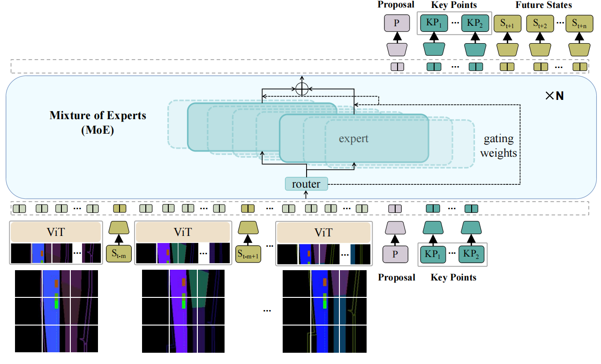

<div align="center">


<!-- # State Transformer 2 -->
<!-- **Generalizing Motion Planners with Mixture of Experts for Autonomous
Driving** -->
<span style="font-size:22px;">Generalizing Motion Planners with Mixture of Experts for Autonomous
Driving</span>

**Author**: [Qiao Sun](https://qiaosun.me/)\*, Huimin Wang\*, [Jiahao Zhan](https://github.com/JohnZhan2023), [Fan Nie](https://github.com/fannie1208/), Xin Wen, Leimeng Xu, Kun Zhan, Peng Jia, Xianpeng Lang, [Hang Zhao](https://hangzhaomit.github.io/)

**Arxiv**:

**Website**: https://tsinghua-mars-lab.github.io/StateTransformer/

______________________________________________________________________


<div align="left">

> Our demonstration video is: [Demonstration](https://www.youtube.com/watch?v=NnoTwXzC4ec)


# Abstract


Large real-world driving datasets have sparked significant research into various aspects of data-driven motion planners for autonomous driving. These include data augmentation, model architecture, reward design, training strategies, and planner pipelines. 
These planners promise better generalizations on complicated and few-shot cases than previous methods.
However, experiment results show that many of these approaches produce limited generalization abilities in planning performance due to overly complex designs or training paradigms. 
In this paper, we review and benchmark previous methods focusing on generalizations. The experimental results indicate that as models are appropriately scaled, many design elements become redundant. We introduce StateTransformer-2 (STR2), a scalable, decoder-only motion planner that uses a Vision Transformer (ViT) encoder and a mixture-of-experts (MoE) causal Transformer architecture. The MoE backbone addresses modality collapse and reward balancing by expert routing during training. Extensive experiments on the NuPlan dataset show that our method generalizes better than previous approaches across different test sets and closed-loop simulations. Furthermore, we assess its scalability on billions of real-world urban driving scenarios, demonstrating consistent accuracy improvements as both data and model size grow.

# Method

* a scalable MoE-based autoregressive model
to learn different explicit rewards for motion planning
* a general raster representation of the environment
* faster model
inference during simulations



# Experiment

* Closed-loop 

| Methods               | NR (Val14 Set) | R (Val14 Set) | NR (TestHard Set) | R (TestHard Set) | NR (Val4k Set) | R (Val4k Set) | NR (Test4k Set) | R (Test4k Set) | InterPlan Score |
|-----------------------|----------------|---------------|-------------------|------------------|----------------|--------------|-----------------|---------------|-----------------|
| Expert (log replay)   | 94             | 80            | 85.96             | 68.80            | 93.08          | 76.91        | 93.12           | 75.01         | 14.76           |
| IDM                   | 75.59          | 77.32         | 56.16             | 62.26            | 72.52          | 76.03        | 72.45           | 74.10         | -               |
| GameFormer            | 82.95          | 83.88         | 66.59             | 68.83            | -              | -            | -               | -             | -               |
| PDM-Hybrid            | 92.84          | 92.12         | 65.07             | 75.18            | 90.31          | 90.62        | 90.65           | 90.13         | 41.61           |
| PlanTF                | 84.72          | 76.25         | 72.59             | 60.62            | 80.52          | 70.84        | 80.90           | 70.62         | 30.53           |
| DTPP                  | 71.66          | 66.09         | 60.11             | 63.66            | 68.43          | 65.24        | 71.98           | 70.20         | 30.32           |
| STR-16m               | 45.06          | 49.69         | 27.59             | 36.13            | 42.27          | 45.16        | 39.66           | 39.62         | -               |
| STR2-CPKS-100m (Ours) | 92.79          | 92.18         | 74.25             | 78.40            | 90.45          | 91.14        | 90.66           | 90.25         | 42.13           |
| STR2-CKS-800m (Ours)  | 92.32          | 92.12         | 74.21             | 78.58            | 90.64          | 91.15        | 90.35           | 90.37         | 44.77           |
| STR2-CPKS-800m (Ours) | **93.91**      | **92.51**     | **77.54**         | **82.02**        | **91.41**      | **91.53**    | **92.14**       | **91.38**     | **46.03**       |


* Open-loop performance

| Methods              | OLS (Val4k Set) | 8sADE (Val4k Set) | 8sFDE (Val4k Set) | OLS (Test4k Set) | 8sADE (Test4k Set) | 8sFDE (Test4k Set) | OLS (Val14 Set) | 8sADE (Val14 Set) | 8sFDE (Val14 Set) |
|----------------------|-----------------|-------------------|-------------------|------------------|--------------------|--------------------|-----------------|-------------------|-------------------|
| PlanCNN              | -               | -                 | -                 | -                | -                  | -                  | 64              | 2.468             | 5.936             |
| PDM-Hybrid           | 84.06           | 2.435             | 5.202             | 82.01            | 2.618              | 5.546              | 84              | 2.382             | 5.068             |
| PlanTF               | 88.59           | 1.774             | **3.892**         | 87.30            | 1.855              | **4.042**          | 89.18           | 1.697             | **3.714**         |
| DTPP                 | 65.15           | 4.196             | 9.231             | 64.18            | 4.117              | 9.181              | 67.33           | 4.088             | 8.846             |
| STR-124m             | 81.88           | 1.939             | 4.968             | 82.68            | 2.003              | 4.972              | 88.0            | 1.777             | 4.515             |
| STR2-CKS-800m (Ours) | **90.07**       | **1.473**         | 4.124             | **89.12**        | **1.537**          | 4.269              | **89.2**        | **1.496**         | 4.210             |


# Usage

## Prepare Environment

Install Pytorch with CUDA first (our recommendation is `pip install torch==1.9.0+cu111 torchvision==0.10.0+cu111 torchaudio==0.9.0 -f https://download.pytorch.org/whl/torch_stable.html`). Then run `pip install -r requirements.txt` to install all dependencies. There are some additional dependencies for NuScenes and Waymo datasets. Please refer to the official websites for more details.

### Install Transformer4Planning

run `pip install -e .` from the root directory of Transformer4Planning.

### Install NuPlan-Devkit
(tested with v1.2)
run `pip install -e .` from the root directory of NuPlan-Devkit.
Then install these packages:

    pip install aioboto3
    pip install retry
    pip install aiofiles
    pip install bokeh==2.4.1


## Dataset

For Li-Auto Dataset, since it belongs to Li Auto and Li Auto currently does not intend to make it public, the LiAuto dataset is not freely available online at the moment.

For NuPlan, we process the dataset into the Hugging Face Dataset format. Click [here](http://180.167.251.46:880/NuPlanSTR/nuplan-v1.1_STR.zip) to download the NuPlan dataset.
Unzip the file and pass the path to the '--saved_dataset_folder' argument to use it.
This dataset contains the training, validation, and the test set.

If you need to customize your dataset, you would need to process the official dataset by our scripts.

- For NuPlan dataset, please refer to the `generation.py` and read the following 'NuPlan Dataset Pipeline' section for more details. 

### NuPlan Dataset Pipeline
Usage:

1. process NuPlan .db files to .pkl files (to agent dictionaries)
2. generate filtered scenario index and cache in .arrow files
3. generate map dictionary to pickles

We recommend you to organize your downloaded dataset in the following way. If you need to process from a customized directory, check `generation.py` for more derivations.

```
    {DATASET_ROOT}
    ├── maps
    │   ├── us-ma-boston
    │   ├── us-pa-pittsburgh-hazelwood
    │   ├── us-nv-las-vegas-strip
    │   ├── sg-one-north
    │   ├── nuplan-maps-v1.0.json
    ├── nuplan-v1.1
    │   │── train_singapore
    │   │   ├── *.db
    │   │── train_boston
    │   │   ├── *.db
    │   │── train_pittsburgh
    │   │   ├── *.db
    │   │── train_las_vegas_1
    │   │   ├── *.db
    │   │── train_las_vegas_2
    │   │   ├── *.db
    │   │── train_las_vegas_3
    │   │   ├── *.db
    │   │── train_las_vegas_4
    │   │   ├── *.db
    │   │── train_las_vegas_5
    │   │   ├── *.db
    │   │── train_las_vegas_6
    │   │   ├── *.db
    │   │── test
    │   │   ├── *.db
    │   │── val
    │   │   ├── *.db
```

Step 1: Process .db to .pkl by running (data_path is the folder name like 'train_singleapore'):
```
    python generation.py  --num_proc 40 --sample_interval 100  
    --dataset_name boston_index_demo  --starting_file_num 0  
    --ending_file_num 10000  --cache_folder {PATH_TO_CACHE_FOLDER}
    --data_path {PATH_TO_DATASET_FOLDER}  --only_data_dic
```

Step 2: Generate scenarios to .arrow datasets
```
    python generation.py  --num_proc 40 --sample_interval 100  
    --dataset_name boston_index_interval100  --starting_file_num 0  
    --ending_file_num 10000  --cache_folder {PATH_TO_CACHE_FOLDER}  
    --data_path {PATH_TO_DATASET_FOLDER}  --only_index  
```

Step 3: Generate Map files to .pickle files

```
    python generation.py  --num_proc 40 --sample_interval 1 --dataset_name {DATASET_NAME}  
    --starting_file_num 0  --ending_file_num 10000  
    --cache_folder {PATH_TO_CACHE_FOLDER}  
    --data_path {PATH_TO_DATASET_FOLDER} --save_map
```

```
    python generation.py  --num_proc 40 --sample_interval 1  
    --dataset_name vegas2_datadic_float32 --starting_file_num 0  --ending_file_num 10000  
    --cache_folder {PATH_TO_CACHE_FOLDER} --data_path {PATH_TO_DATASET_FOLDER} --save_map
```

You only need to process Vegas's map once for all Vegas subsets.


Why process .db files to .pkl files? Lower disk usage (lower precision) and faster loading (without initiate NuPlan DataWrapper)


```
root-
 |--train
      |--us-ma-boston
         --*.pkl
      |--us-pa-pittsburgh-hazelwood
    ...
 |--test
     |--us-ma-pittsburgh
        --*.pkl
     ...
 |--map
    --us-ma-boston.pkl
    --us-pa-pittsburgh-hazelwood.pkl
    --us-nv-las-vegas-strip.pkl
    --sg-one-north
    ...
 |--index (can be organized dynamically)
    |--train
        |--train-index_boston
            --*.arrow
    |--test
        |--test-index_pittsburgh
            --*.arrow    
```


```
root-
 |--train
     --*.pkl
    ...
 |--test
    --*.pkl
     ...
 |--index (can be organized dynamically)
    |--train
        --*.arrow
    |--test
        --*.arrow    
```


## To train and evaluate during training:

`--model_name` can choose from ```["mixtral-small-wide","mixtral-small","mixtral-200m","mixtral-medium","mixtral-800m","mixtral-1b","mixtral-3b-deep","mixtral-3b-wide","mixtral-6b-deep"]``` and with prefix of `scratch-` or `pretrain-` to determine wether load pretrained weights from existed checkpoints, whose attributes is `--model_pretrain_name_or_path`

The common training settings are shown below.

``` sh
python -m torch.distributed.run \
--nproc_per_node=8 --master_port 12345 runner.py \
--model_name scratch-mixtral-800m-deep \
--model_pretrain_name_or_path None \
--saved_dataset_folder {PATH_TO_DATASET_FOLDER} \
--output_dir {PATH_TO_OUTPUT_FOLDER} \
--logging_dir {PATH_TO_LOG_FOLDER} \
--run_name {EXPERIMENT_NAME} \
--num_train_epochs 20 \
--per_device_train_batch_size 16 \
--warmup_steps 50 \
--weight_decay 0.01 \
--logging_steps 100 \
--save_strategy steps \
--save_steps 6000 \
--dataloader_num_workers 24 \
--dataloader_drop_last True \
--save_total_limit 5 \
--do_train \
--task nuplan \
--remove_unused_columns False \
--do_eval \
--evaluation_strategy epoch \
--per_device_eval_batch_size 8 \
--predict_yaw True \
--use_proposal 0 \
--selected_exponential_past True \
--mean_circular_loss True \
--raster_channels 34 \
--use_mission_goal False \
--raster_encoder_type vit \
--vit_intermediate_size 768 \
--lr_scheduler_type cosine_with_restarts \
--num_cycles 10 \
--use_speed \
--use_key_points specified_backward \
--augment_current_pose_rate 0.5 \
--augment_current_with_past_linear_changes True \
--augment_index 5 \
--attn_implementation flash_attention_2 \
--sync_norm True \
--bf16 True \
--do_sim_val \
--nuplan_sim_exp_root {SIMULATION_EXPERIMENT_PATH} \
--nuplan_sim_data_path {SIMULATION_DATA} \
--max_sim_samples 64 \
--inspect_kp_loss \
--kp_dropout 0.1 \
--report_to wandb \
--output_router_logits True \
--augment_method track \
--augment_max_dy 0.5 \
--augment_max_dyaw 0.05 \
--state_separate_embed True \
--overwrite_output_dir
```

The simulation data should be the raw data from nuplan ended with ```.db```.

## To run closed-loop simulation:

The checkpoints have been updoaded on huggingface, and you can resort to: [STR2](https://huggingface.co/JohnZhan/StateTransformer2)


After downloading, the path to the downloaded model should be given to the model path below.

```sh
python run_nuplan_simulation.py \
--test_type closed_loop_nonreactive_agents \
--data_path {SIMULATION_DATA} \
--map_path {MAP_PATH} \
--model_path {MODEL_CHECKPOINT_PATH} \
--split_filter_yaml nuplan_simulation/test14_hard.yaml \
--max_scenario_num 10000 \
--batch_size 8 \
--device cuda \
--exp_folder TestHard14_MixtralM_CKS_SepLoss_AugCur50Pct_PastProj_S6_bf16_Jun28_ckpt150k\
--processes-repetition 8
```

Test type can be chosen from ```["closed_loop_nonreactive_agents","closed_loop_reactive_agents","open_loop_boxes"]```

The split filter yaml can be found in ```nuplan_simulation```. Changing the yaml file can run simulation on different splits of the test set or the val set.


## Visualization

Based on the simulation directory generated before, the visualization will be realized by using the command:

``python run_nuplan_nuboard.py simulation_path='[/home/sunq/nuplan/exp/exp/simulation/test/2023.05.08.19.17.16]' 'scenario_builder=nuplan' 'port_number=5005'``


# Previous work

The previous work of StateTransformer2 is the [StateTransformer](https://arxiv.org/abs/2310.19620). The code can be available found in this repository under the commit ```61922dc889bdafe04340b4e363e151a771fe1729``` in the ```main``` branch.

# Citation
If you find this work useful in your research, please consider cite:
```
coming soon
```
